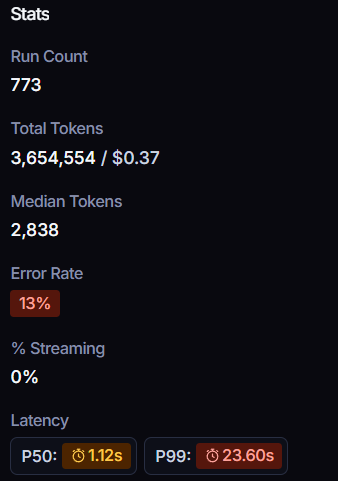
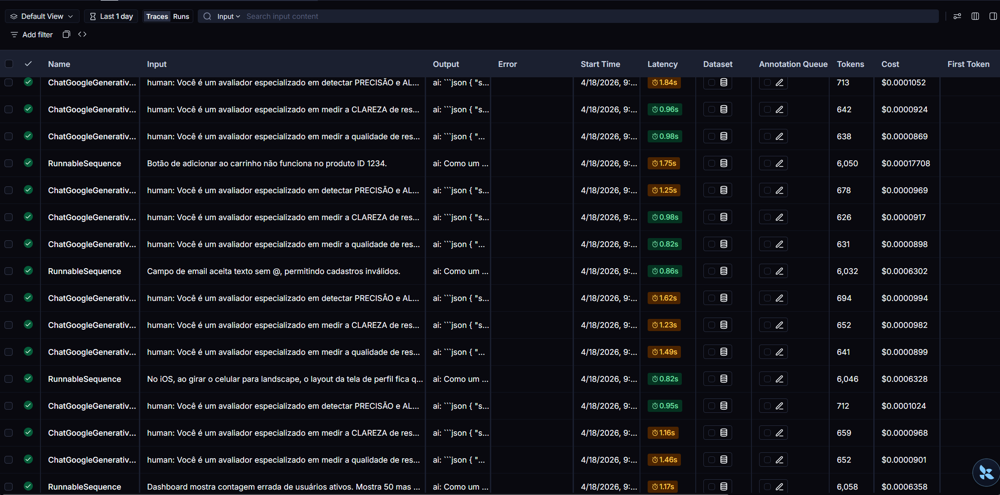
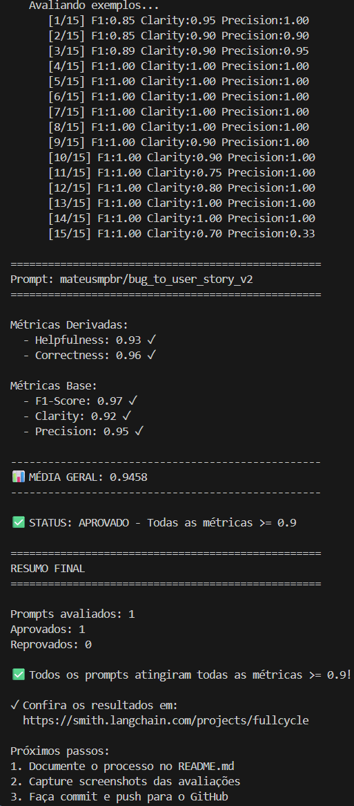

# Técnicas Aplicadas

- **Role Prompting**
  - **Justificativa para escolha**: essa técnica é fundamental para refatorar o prompt, pois permite definir uma persona específica (no caso, um product manager) que orienta o modelo na geração das histórias de usuário.
  - **Como foi aplicada**: solicitei ao modelo para ele atuar como um Product Manager sênior e redator técnico, estabelecendo desde o início o estilo e o comportamento esperados.

- **Few-shot Prompting**
  - **Justificativa para escolha**: ao usar essa técnica, forneço exemplos que calibram o comportamento do modelo e mostram exatamente como ele deve responder.
  - **Como foi aplicada**: incluí amostras de respostas ideais, demonstrando ao modelo o formato e o nível de detalhamento esperado ao converter relatos de bugs em histórias de usuário.

- **Chain of Thought**
  - **Justificativa para escolha**: essa técnica melhora o raciocínio e aumenta a precisão, incentivando o modelo a pensar de forma estruturada, “passo a passo”.
  - **Como foi aplicada**: instruí o modelo a explicitar seu raciocínio quando necessário, seguindo a lógica do Chain of Thought para chegar a respostas mais consistentes.

# Modelos de IA utilizados

- **LLM_PROVIDER**=google
- **LLM_MODEL**=gemini-2.5-flash-lite
- **EVAL_MODEL**=gemini-2.5-flash-lite

# Resultados Finais

- **Prompt no LangSmith**: https://smith.langchain.com/hub/mateusmpbr/bug_to_user_story_v2

- **Estatísticas no LangSmith**:
- 

- **Alguns traces no LangSmith**:
- 

- **Resultado das avaliações**:
- 

# Como Executar

## Pré-requisitos

- Linux
- Python 3.11 (se o binário for diferente ajuste `./setup.sh`, por exemplo `python3` ou `python3.12`, só é necessário ser >= 3.11)

## Passos de instalação e execução

### 1. Preparar o ambiente e dependências

```bash
./setup.sh
```

O script `setup.sh` copia `.env.example` para `.env`, cria um `venv` em `./venv` e instala dependências.

### 2. Preencher o arquivo `.env`

Após o `setup.sh` será gerado o arquivo `.env`. Preencha com os dados necessários, e escolha entre usar os modelos da Open AI ou do Google.

### 3. Ativar o ambiente virtual

```bash
source venv/bin/activate
```

### 4. Fazer pull do prompt inicial

```bash
python src/pull_prompts.py
```

### 5. Fazer push do prompt aprimorado

```bash
python src/push_prompts.py
```

### 6. Rodar avaliação para prompt aprimorado

```bash
python src/evaluate.py
```

## Execução rápida (resumo dos comandos)

```bash
./setup.sh
# editar .env (preencher OPENAI_API_KEY ou GOOGLE_API_KEY e outros dados necessários)
source venv/bin/activate
python src/pull_prompts.py
python src/push_prompts.py
python src/evaluate.py
```

## Instruções do desafio

As instruções do desafio estão em `INSTRUCTIONS.md`

## Logs e mensagens

As mensagens, erros e prompts estão em português.

## Suporte

Se houver problemas de import de pacotes, verifique se o `venv` está ativado e se as dependências foram instaladas com sucesso (`pip install -r requirements.txt`).
